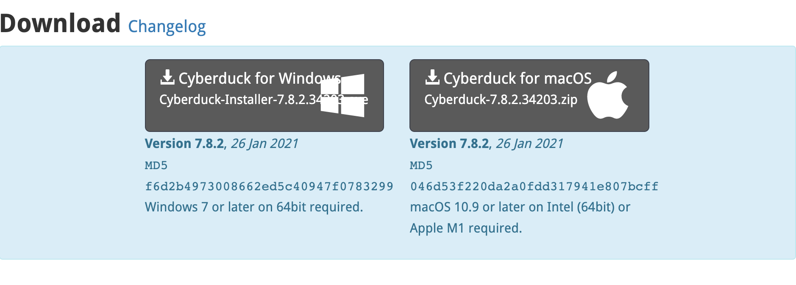
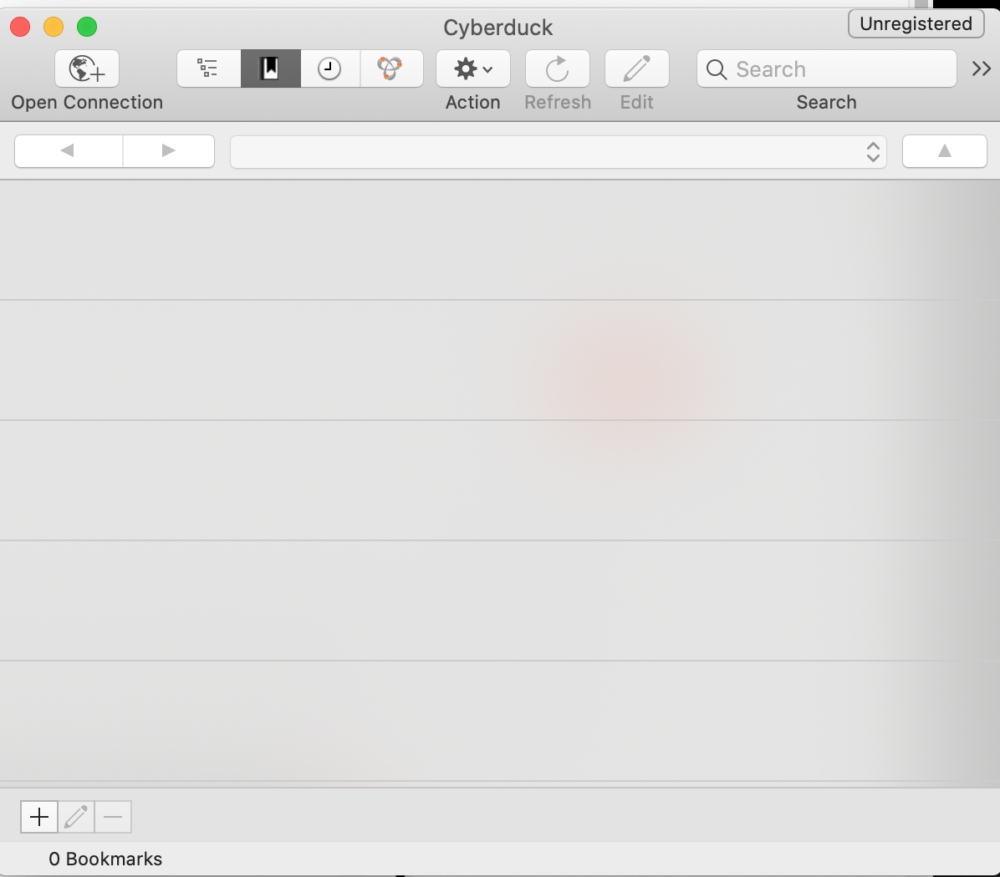
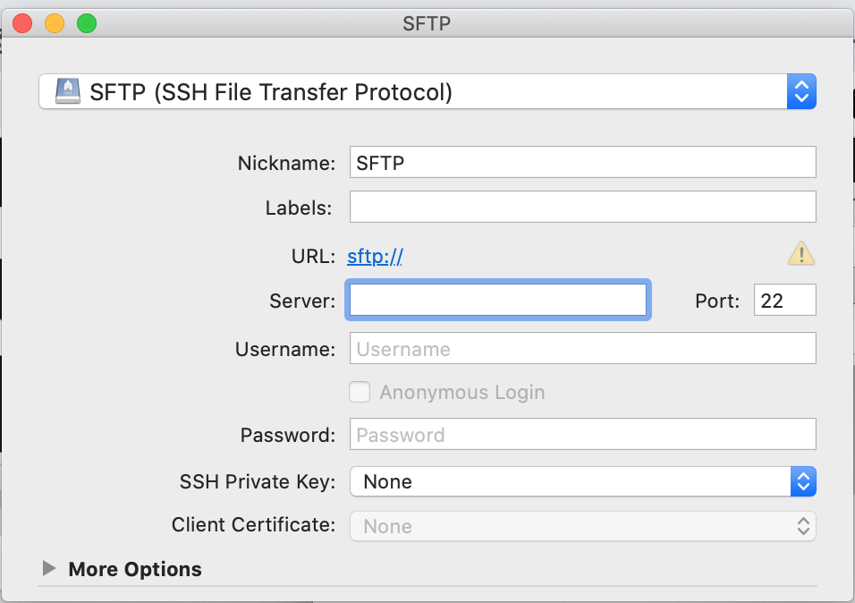

<h1 class="capitalize">COMD2451</h1>
<h2 class="capitalize center">Installing and Setting up Cyberduck</h2>

---

<section class="section">
    <h2 class="sentence">Installing Cyberduck</h2>

***First***, ***go*** to the `Cyberduck` [download link](https://cyberduck.io/download/) on the `Cyberduck` ***web site***.

***Next***, ***click*** on `Cyberduck for macOS` in the `Download` ***area*** with the ***blue*** `background`.

    

***Next***, follow the `download` ***instructions***.

</section>

---

<section class="section">
    <h2 class="sentence">How to find Cyberduck on your Mac</h2>

***Once*** you have `successfully` ***installed*** `Cyberuck`, ***go*** to your `Spotlight Search` and ***type in*** `Cyberduck`, and it will ***appear*** in the `Spotlight Search` ***results***.

***Next***, ***click*** on the `Cyberduck` ***icon***.

</section>

---

<section class="section">
    <h2 class="sentence">How to set up Cyberduck</h2>

***Once*** you have ***launched*** `Cyberuck`, to ***set up*** a ***new*** `SFTP connection`, you can ***click*** the `+ button` to the ***bottom*** `left` of the `Cyberduck` ***window***. This will ***create*** a ***new*** `bookmark`. OR you can ***click*** on the `Open Connection` ***tab***.

   
    

***Next***, ***select*** the `SFTP` ***option*** (`SSH File Transfer Protocol`) at the ***top*** of the `Edit` ***window***.

    

</section>

---

<section class="section">
    <h2 class="sentence">The new connection button</h2>

First ***click*** the [Open Connection button](https://www.exavault.com/docs/ftp-clients/cyberduck/01-connecting) in the `Cyberduck` ***toolbar***. You will ***need*** to ***enter*** a few ***details*** to get ***connected***:

+ `Protocol`: `SFTP` is ***strongly*** recommended.

+ `Server`: This is your `server IP address`.

+ ***Click*** the `Connect` ***button*** to ***connect*** to your ***account***.

The `username` that you should ***use*** is the one that is ***sent*** to you ***after*** you have ***purchased*** your `hosting plan` with `Namecheap`. It will ***contain*** the `username` and `password` for your `cpanel` ***log in***, and it will ***also*** give you the `server` ***information*** and `url` ***options***. 

I did have one ***little*** `problem` with the `URL` to ***use*** if my `DNS` was ***not*** `propagated` ***yet*** (which it ***wasn't*** at the ***time*** of this ***slide deck***). ***Try*** it with the `/cpanel` ***extension***, and if ***that*** does ***not*** work, ***try*** it ***without*** it.

If you have ***any*** `problems` ***setting up*** `outside` of ***class time***, please ***reach out*** to me on `Discord`, and I will be ***very*** happy to ***assist*** you!

</section>

---

<section class="section">
    <h2 class="sentence">Uploading a file to your Namecheap server</h2>
    
Once you have ***connected*** with your ***remote server*** on `Namecheap`, ***click*** on the `folder` ***called*** `home`. Once it has ***expanded***, ***click*** on the `folder` ***inside*** the `home folder` which has the ***same name*** as your `cPanel username`. When your `"username" folder` ***expands*** upon ***click***, You will see ***another*** `folder` ***inside*** called `"public_html".` ***That*** is the `root folder` of your `web site`, and ***where*** you ***should*** be ***uploading*** your `files` and `folders` at the ***root*** of the *`public_html`* `folder`. If they are ***not uploaded*** there, ***nothing*** will be ***pointing*** to your `site`, and the `site pages` will be ***blank***!

</section>

---

<section class="section">
    <h2 class="sentence">Related Resources</h2>

+ [How do I upload my site?: Namecheap](https://www.namecheap.com/support/knowledgebase/article.aspx/181/27/how-do-i-upload-my-site/#2)

+ [How to Connect a Domain to a Server or Hosting: Namecheap](https://www.namecheap.com/support/knowledgebase/article.aspx/9837/46/how-to-connect-a-domain-to-a-server-or-hosting/#hostingwus)

</section>